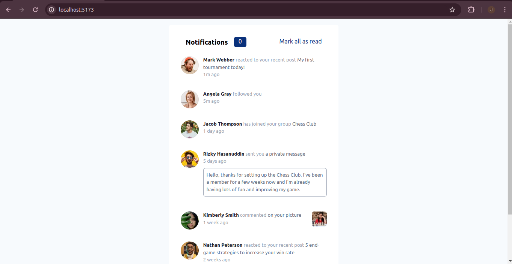
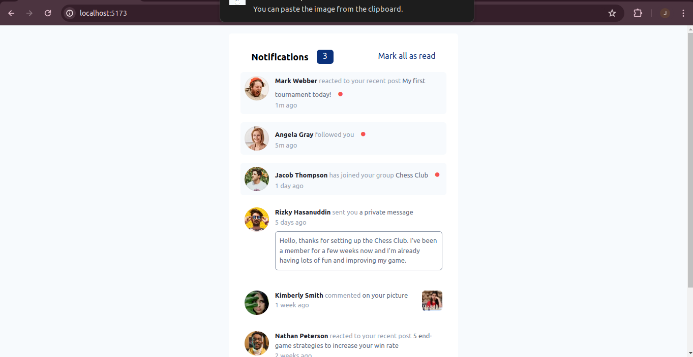
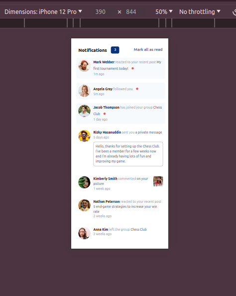

# Frontend Mentor - Notifications page solution

This is a solution to the [Notifications page challenge on Frontend Mentor](https://www.frontendmentor.io/challenges/notifications-page-DqK5QAmKbC). Frontend Mentor challenges help you improve your coding skills by building realistic projects.

## Table of contents

- [Overview](#overview)
  - [The challenge](#the-challenge)
  - [Screenshot](#screenshot)
  - [Links](#links)
- [My process](#my-process)
  - [Built with](#built-with)
  - [What I learned](#what-i-learned)
  - [Continued development](#continued-development)
  - [Useful resources](#useful-resources)
- [Author](#author)

## Overview

### The challenge

Users should be able to:

- Distinguish between "unread" and "read" notifications
- Select "Mark all as read" to toggle the visual state of the unread notifications and set the number of unread messages to zero
- View the optimal layout for the interface depending on their device's screen size
- See hover and focus states for all interactive elements on the page

### Screenshot

### Links

- Solution URL: [GitHub](https://github.com/njeruthuo/notifications)
- Live Site URL: [Vercel deployment](notifications-dialvnh2d-julius-njerus-projects.vercel.app)

## My process

I collected all the users and added them to an object which I iterated over and used conditional rendering to display the properties not found in other objects

### Built with

- Flexbox
- JavaScript
- TailwindCSS
- Mobile-first workflow
- [React](https://reactjs.org/) - JS library
- [Styled Components](https://styled-components.com/) - For styles

### Continued development

As usual, if you have a better way of doing anything in this project, hit me up asap

- juliusn411@gmail.com

### Useful resources

- [TailwindCSS](https://tailwindcss.com/docs/installation) - Tailwind CSS works by scanning all of your HTML files, JavaScript components, and any other templates for class names, generating the corresponding styles and then writing them to a static CSS file.
- [Vite ](https://vitejs.dev)

## Author

<!-- - Website - [Add your name here](https://www.your-site.com) -->
- Frontend Mentor - [@njeruthuo](https://www.frontendmentor.io/profile/njeruthuo)
- Twitter - [@njeru19_njeru](https://www.twitter.com/njeru19_njeru)

